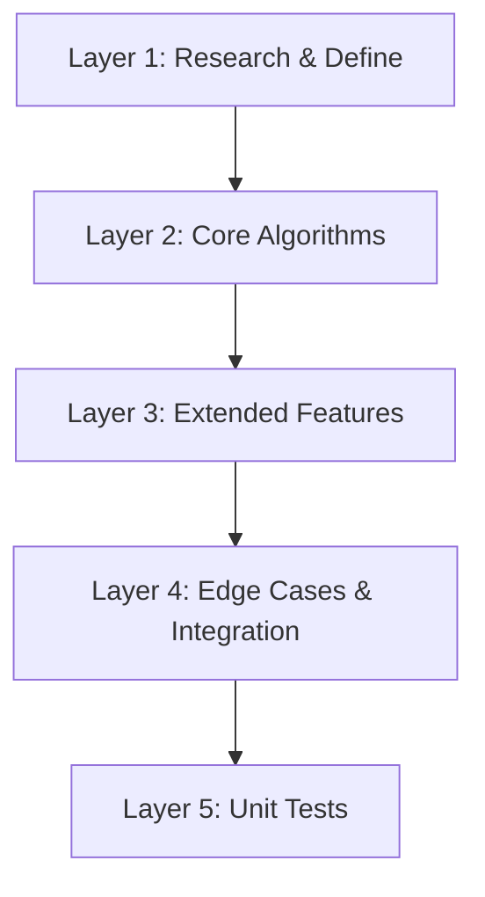

# Phase 1 Pattern Analysis Engine for Enhanced Duplication Detection
**Session Date**: 2025-11-23
**Project**: ast-grep-mcp
**Focus**: Implement Phase 1 of enhanced duplication detection - Pattern Analysis Engine

## Executive Summary

Successfully implemented the complete Phase 1 Pattern Analysis Engine for the ast-grep-mcp project. This adds comprehensive capabilities for analyzing duplicate code patterns, identifying variations, scoring refactoring complexity, and generating enhanced refactoring suggestions.

The implementation adds 4,511 lines of new code to main.py and 258 new unit tests across 6 test files. All 28 planned tasks were completed using a parallelized workflow with pr-comment-resolver agents executing in 5 dependency layers.

## Problem Statement

The existing `find_code_duplication` tool could detect duplicate code but lacked detailed analysis of:
- What specifically varies between duplicates
- How complex a refactoring would be
- What parameters should be extracted
- What import changes would be needed
- What refactoring strategy to recommend

## Implementation Details

### Core Components Added

**1. AST Node Alignment** (`main.py:3089-3296`)
- `AlignmentSegment` and `AlignmentResult` dataclasses
- `align_code_blocks()` function using difflib.SequenceMatcher
- Handles multi-line constructs, continuations, block structures
- `format_alignment_diff()` for human-readable output

**2. Diff Tree Structure** (`main.py:3494-3715`)
- `DiffTreeNode` and `DiffTree` dataclasses
- `build_diff_tree()` and `build_nested_diff_tree()` functions
- Tree traversal and query methods

**3. Variation Identification**
- `identify_varying_literals()` - strings, numbers, booleans
- `identify_varying_identifiers()` - variables, functions, classes
- `identify_varying_expressions()` - operators, calls, compounds
- Supports Python, JavaScript, TypeScript

**4. Variation Classification** (`main.py:3091-3489`)
- Categories: LITERAL, IDENTIFIER, EXPRESSION, LOGIC, TYPE
- Severity levels: LOW, MEDIUM, HIGH
- Per-variation complexity scoring

**5. Import Analysis**
- `extract_imports_from_files()` - 10+ language support
- `detect_import_variations()` - common/unique/partial/aliased
- `analyze_import_overlap()` - shared vs unique imports
- `detect_internal_dependencies()` - local/imported/unresolved calls

**6. Complexity Scoring** (`main.py:4338-4427`)
- Weighted formula with 8 factors
- 1-10 scale with calibrated thresholds
- `get_complexity_level()` returns low/medium/high with descriptions

**7. Enhanced Suggestions** (`main.py:4620-5023`)
- Updated `generate_refactoring_suggestions()` signature
- New fields: parameter_details, import_analysis, complexity, refactoring_strategies
- Strategy recommendations based on complexity level
- Backward compatible with `include_enhanced_analysis` flag

**8. Edge Case Handling**
- Multi-line vs single-line differences with metadata
- Nested function calls as parameters
- Parameter name generation with collision avoidance
- Complex type inference for Python and TypeScript

### Unit Tests Created

| Test File | Tests | Coverage |
|-----------|-------|----------|
| test_ast_diff.py | 49 | Alignment, DiffTree, formatting |
| test_parameter_extraction.py | 66 | Literals, identifiers, types, names |
| test_variation_classification.py | 48 | Categories, severity, conditionals |
| test_dependency_analysis.py | 41 | Imports, variations, dependencies |
| test_complexity_scoring.py | 38 | Scoring, thresholds, boundaries |
| test_enhanced_suggestions.py | 16 | Enhanced fields, strategies |
| **Total** | **258** | |

### Workflow Approach

Used `/compounding-engineering:resolve_todo_parallel` with dependency analysis:



Each layer executed tasks in parallel via pr-comment-resolver agents, respecting dependencies between layers.

## Key Decisions and Trade-offs

**1. ast-grep JSON limitations**
- Found: No node types, no tree structure, pattern-based only
- Solution: Use specific patterns, position data, metaVariables

**2. Complexity scoring formula**
- 8 weighted factors with raw score 0-30 scaled to 1-10
- Calibrated with test scenarios for realistic thresholds

**3. Backward compatibility**
- All new fields are additive
- `include_enhanced_analysis=False` returns original format

## Known Issues

One bug found: `detect_conditional_variations` references undefined `logger` at line 3849. 9 tests skipped pending fix.

## Results

### Code Metrics

| Metric | Value |
|--------|-------|
| Lines added to main.py | 4,511 |
| New test files | 6 |
| New tests | 258 |
| Tasks completed | 28/28 |

### Commit

```
426f8ef feat: implement Phase 1 Pattern Analysis Engine for enhanced duplication detection
```

14 files changed, 7,924 insertions(+), 159 deletions(-)

## Next Steps

Phase 2-6 remain for complete Enhanced Duplication Detection:
- Phase 2: Code Generation Engine
- Phase 3: Automated Application Tool
- Phase 4: Analysis & Ranking Tool
- Phase 5: Enhanced Reporting & UI
- Phase 6: Testing & Documentation

Todo files created in `todos/` directory for tracking.

## References

- `main.py:3089-6038` - New Phase 1 functions
- `tests/unit/test_*.py` - New test files
- `todos/phase-1-pattern-analysis.md` - Task tracking
- `dev/active/enhanced-duplication-detection/` - Planning docs
