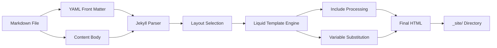
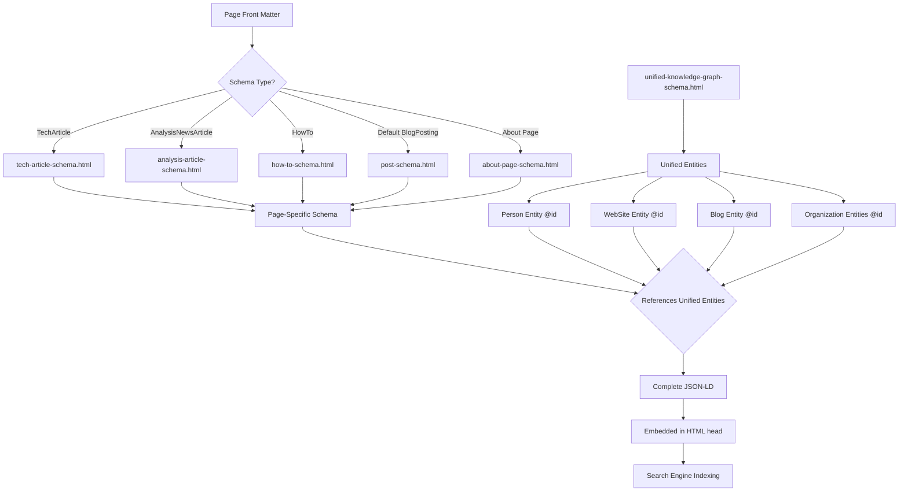
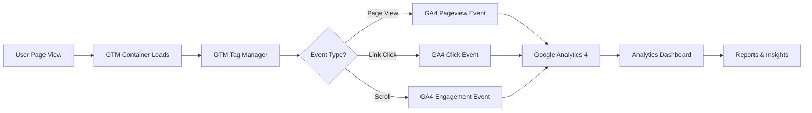
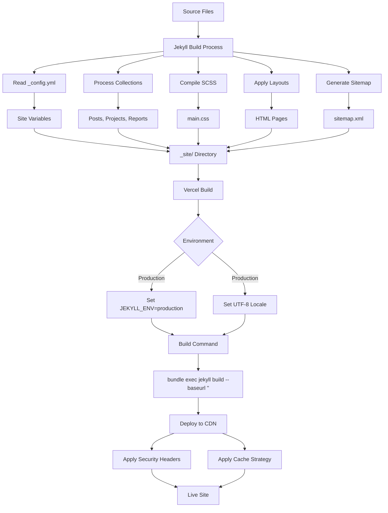
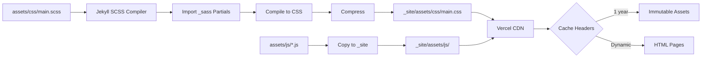
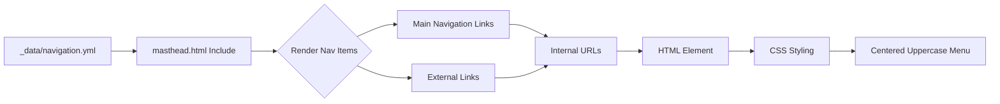
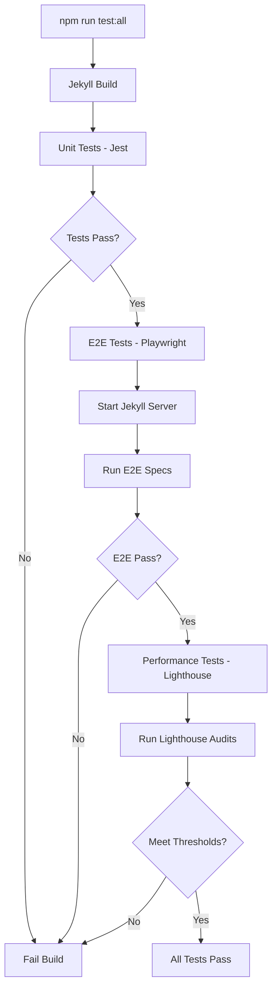
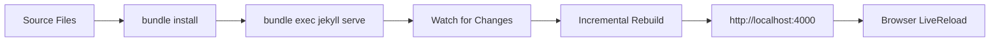
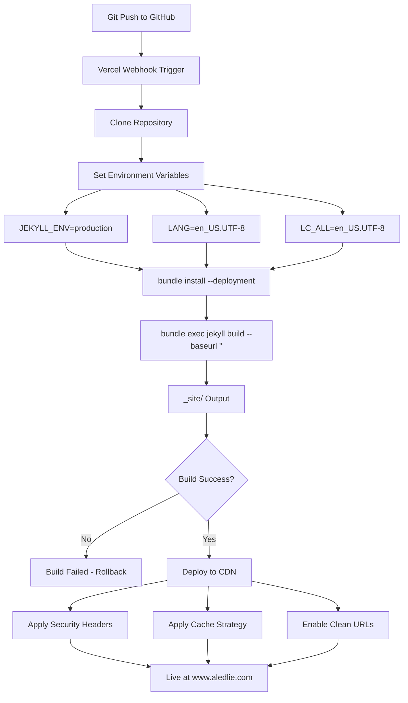
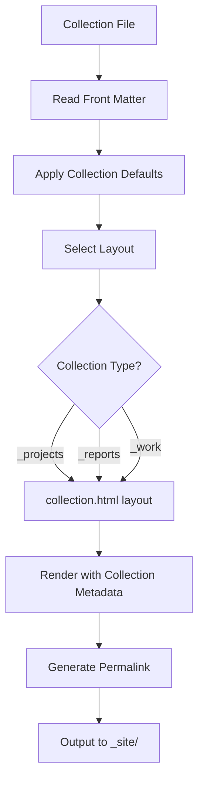

# Architecture and Data Flow Documentation

**Last Updated:** 2025-11-17
**Project:** The Parlor (www.aledlie.com)
**Purpose:** Comprehensive architectural patterns and data flow documentation

---

## Table of Contents

1. [Architecture Overview](#architecture-overview)
2. [Data Flow Patterns](#data-flow-patterns)
3. [Component Relationships](#component-relationships)
4. [Schema.org Architecture](#schemaorg-architecture)
5. [Testing Architecture](#testing-architecture)
6. [Build and Deployment Pipeline](#build-and-deployment-pipeline)
7. [Configuration Cascade](#configuration-cascade)

---

## Architecture Overview

### High-Level System Architecture

```
┌─────────────────────────────────────────────────────────────────┐
│                         CONTENT LAYER                            │
│  _posts/    _projects/    _reports/    _work/    pages/         │
│  (Markdown files with YAML front matter)                        │
└────────────────────────┬────────────────────────────────────────┘
                         │
                         ▼
┌─────────────────────────────────────────────────────────────────┐
│                      JEKYLL BUILD LAYER                          │
│  ┌──────────────┐  ┌──────────────┐  ┌──────────────┐         │
│  │  _config.yml │  │  Collections │  │   Plugins    │         │
│  │   Settings   │  │  Processing  │  │  (paginate,  │         │
│  │              │  │              │  │   sitemap)   │         │
│  └──────────────┘  └──────────────┘  └──────────────┘         │
└────────────────────────┬────────────────────────────────────────┘
                         │
                         ▼
┌─────────────────────────────────────────────────────────────────┐
│                     TEMPLATE LAYER                               │
│  ┌──────────────┐  ┌──────────────┐  ┌──────────────┐         │
│  │   _layouts/  │  │  _includes/  │  │    _sass/    │         │
│  │   (Render    │  │  (Schema,    │  │   (Styles)   │         │
│  │   Structure) │  │   Partials)  │  │              │         │
│  └──────────────┘  └──────────────┘  └──────────────┘         │
└────────────────────────┬────────────────────────────────────────┘
                         │
                         ▼
┌─────────────────────────────────────────────────────────────────┐
│                        OUTPUT LAYER                              │
│               _site/ (Static HTML + Assets)                      │
│  ┌──────────────┐  ┌──────────────┐  ┌──────────────┐         │
│  │  HTML Pages  │  │  CSS/JS/Img  │  │  Schema.org  │         │
│  │              │  │   (assets/)  │  │  (JSON-LD)   │         │
│  └──────────────┘  └──────────────┘  └──────────────┘         │
└────────────────────────┬────────────────────────────────────────┘
                         │
                         ▼
┌─────────────────────────────────────────────────────────────────┐
│                    DEPLOYMENT LAYER                              │
│              Vercel (CDN + Edge Network)                         │
│  ┌──────────────┐  ┌──────────────┐  ┌──────────────┐         │
│  │   Security   │  │    Cache     │  │   Analytics  │         │
│  │   Headers    │  │   Strategy   │  │   (GTM/GA4)  │         │
│  └──────────────┘  └──────────────┘  └──────────────┘         │
└─────────────────────────────────────────────────────────────────┘
```

---

## Data Flow Patterns

### 1. Content-to-HTML Flow

**Path:** Markdown → Jekyll → Liquid Templates → HTML



**Detailed Steps:**

1. **Content Creation**
   - File: `_posts/YYYY-MM-DD-title.md`
   - Front matter defines metadata (layout, title, date, schema_type, etc.)
   - Content body in Markdown format

2. **Jekyll Processing**
   - Reads front matter YAML
   - Applies defaults from `_config.yml`
   - Converts Markdown to HTML via kramdown
   - Processes Liquid tags and variables

3. **Layout Application**
   - Selects layout based on `layout:` front matter
   - Layouts inherit (e.g., home → archive → default → compress)
   - Each layout wraps content with structure

4. **Include Insertion**
   - Processes `` tags
   - Inserts partials (navigation, footer, schema, etc.)
   - Passes variables to includes

5. **Final Output**
   - Complete HTML page with all assets
   - Schema.org JSON-LD embedded in `<head>`
   - CSS/JS references injected
   - Output to `_site/` directory

**Example Flow for Blog Post:**

```
_posts/2025-11-17-example.md
    ↓ (Front matter: layout: single, schema_type: TechArticle)
_layouts/single.html
    ↓ (Layout inheritance: single → default)
_layouts/default.html
    ↓ (Includes head, masthead, content, footer)
_includes/_head.html
    ↓ (Includes seo.html for schema)
_includes/seo.html
    ↓ (Conditional schema based on schema_type)
_includes/tech-article-schema.html
    ↓ (Final HTML with embedded Schema.org)
_site/posts/example/index.html
```

---

### 2. Schema.org Data Flow

**Path:** Front Matter → Schema Includes → Unified Knowledge Graph → HTML Output



**Schema Selection Logic (in seo.html):**

```liquid



  

  

  

  





```

**Entity Reference Pattern:**

```json
{
  "@context": "https://schema.org",
  "@graph": [
    {
      "@type": "Person",
      "@id": "https://www.aledlie.com#person",
      "name": "Alyshia Ledlie"
    },
    {
      "@type": "BlogPosting",
      "@id": "https://www.aledlie.com/posts/example#blogposting",
      "author": {
        "@id": "https://www.aledlie.com#person"
      },
      "publisher": {
        "@id": "https://www.aledlie.com#person"
      }
    }
  ]
}
```

**Key Benefits:**
- **Unified Entities:** Person, WebSite, Blog, Organizations defined once in `unified-knowledge-graph-schema.html`
- **@id References:** Page-specific schemas reference unified entities via `@id` (no duplication)
- **Scalability:** Add new pages without redefining core entities
- **SEO:** Search engines understand entity relationships across site

---

### 3. Analytics Data Flow

**Path:** Page Interaction → GTM → GA4 → Analytics Dashboard



**Implementation Details:**

1. **GTM Initialization (in default.html):**
   ```html
   <body>
     
     
     <!-- Rest of page -->
   </body>
   ```

2. **GTM Configuration:**
   - Container ID: `GTM-TK5J8L38`
   - Tracking ID: `G-J7TL7PQH7S`
   - Anonymous IP: Enabled for privacy

3. **Event Tracking:**
   - Automatic pageviews
   - Custom events (defined in GTM)
   - E-commerce tracking (if applicable)
   - User interactions

4. **Data Privacy:**
   - Do Not Track respect
   - Anonymous IP collection
   - GDPR compliance ready

**Testing:**
- Unit tests: `/tests/analytics/`
- E2E tests: `/tests/e2e/analytics.spec.js`
- Validates GTM loading, tracking code presence, event firing

---

### 4. Build Process Data Flow

**Path:** Source Files → Jekyll Build → _site Output → Vercel Deployment



**Build Configuration (vercel.json):**

```json
{
  "buildCommand": "bundle exec jekyll build --baseurl ''",
  "outputDirectory": "_site",
  "installCommand": "bundle install --deployment",
  "env": {
    "JEKYLL_ENV": "production",
    "LANG": "en_US.UTF-8",
    "LC_ALL": "en_US.UTF-8"
  }
}
```

**Build Phases:**

1. **Dependency Installation**
   - `bundle install --deployment`
   - Installs Ruby gems from Gemfile.lock
   - Required gems: Jekyll 4.3, theme, plugins

2. **SCSS Compilation**
   - Source: `assets/css/main.scss`
   - Imports: `_sass/variables.scss`, `_sass/minimal-mistakes.scss`
   - Output: `_site/assets/css/main.css` (compressed)

3. **Content Processing**
   - Posts from `_posts/`
   - Collections from `_projects/`, `_reports/`, `_work/`
   - Pages from root and subdirectories

4. **Asset Copying**
   - Images from `images/`
   - JavaScript from `assets/js/`
   - Fonts and other static assets

5. **Output Generation**
   - All files written to `_site/`
   - Clean URLs enabled
   - Trailing slashes added

---

### 5. Asset Pipeline Flow

**Path:** SCSS/JS Sources → Compilation → Optimized Assets → CDN



**SCSS Architecture:**

```
assets/css/main.scss
    ├── @import "variables"
    │   └── Color definitions, font stacks, spacing
    ├── @import "minimal-mistakes"
    │   └── Theme base styles (vendor)
    └── Custom overrides
        ├── Global typography (16px base, 1.7 line-height)
        ├── Header (compact 100px cover images)
        ├── Navigation (centered, uppercase PT Sans Narrow)
        ├── Sidebar (academic profile layout)
        ├── Content (1200px max-width)
        └── Post lists (clean, minimal styling)
```

**JavaScript Assets:**

- `email-obfuscation.js` - Security script for email protection
- `csrf-protection.js` - CSRF token handling
- Vendor scripts from theme (cached with includes)

**Optimization Strategy:**

1. **SCSS Compression**
   - `style: compressed` in `_config.yml`
   - Minifies output CSS

2. **Cache Strategy (vercel.json)**
   - CSS/JS/Images: `max-age=31536000, immutable` (1 year)
   - HTML: Dynamic (no long-term cache)
   - Explicit UTF-8 charset for CSS/JS

3. **CDN Distribution**
   - Vercel edge network
   - Global distribution
   - Automatic HTTPS

---

## Component Relationships

### Layout Inheritance Hierarchy

```
compress.html (Base - HTML compression)
    ↓
default.html (Core structure - head, body, footer)
    ↓
┌───────────┴──────────┬─────────────┬──────────────┐
│                      │             │              │
archive.html      single.html    page.html    splash.html
    ↓                  │
┌───┴───┐             │
│       │             │
home  post-index      └─→ Individual posts and pages
```

**Layout Responsibilities:**

1. **compress.html**
   - HTML minification
   - Whitespace removal
   - Base HTML5 structure

2. **default.html**
   - `<head>` with SEO, schema, analytics
   - `<body>` structure
   - Masthead (navigation)
   - Footer
   - Script includes

3. **archive.html**
   - Base archive layout
   - Breadcrumbs (if enabled)
   - Sidebar inclusion
   - Archive container

4. **home.html** (extends archive)
   - Recent posts display
   - Pagination
   - Calls `documents-collection.html` include

5. **post-index.html** (extends archive)
   - Posts grouped by year
   - Archive subtitle

6. **single.html** (extends default)
   - Page hero (header image)
   - Breadcrumbs
   - Article structure
   - Author profile
   - Table of contents (if enabled)
   - Post pagination
   - Comments (if enabled)
   - Related posts

7. **collection.html**
   - For projects, reports, work collections
   - Grid or list display

**Layout Selection (Front Matter):**

```yaml
---
layout: single  # Triggers _layouts/single.html
---
```

**Default Layouts (_config.yml):**

```yaml
defaults:
  - scope:
      path: ""
      type: posts
    values:
      layout: single
      show_date: true
      author_profile: true
  - scope:
      path: ""
      type: pages
    values:
      layout: single
      show_date: false
```

---

### Include System Architecture

```
_includes/
├── Core Partials
│   ├── head.html → SEO, meta tags, CSS
│   ├── masthead.html → Navigation bar
│   ├── sidebar.html → Author profile, TOC
│   ├── footer.html → Site footer
│   └── scripts.html → JavaScript loading
│
├── Schema.org (Structured Data)
│   ├── unified-knowledge-graph-schema.html (Core entities)
│   ├── post-schema.html (BlogPosting)
│   ├── tech-article-schema.html (TechArticle)
│   ├── analysis-article-schema.html (AnalysisNewsArticle)
│   ├── how-to-schema.html (HowTo)
│   ├── about-page-schema.html (Person/ProfilePage)
│   ├── breadcrumb-schema.html (BreadcrumbList)
│   └── webpage-schema.html (WebPage)
│
├── Analytics
│   ├── _google_tag_manager.html (GTM container)
│   ├── _google_tag_manager_noscript.html (No-JS fallback)
│   └── _google_analytics.html (GA4 tracking)
│
├── SEO & Metadata
│   ├── seo.html (Meta tags, OG, Twitter cards, schema orchestration)
│   ├── _open-graph.html (Open Graph tags)
│   └── breadcrumbs.html (Breadcrumb navigation)
│
└── Content Components
    ├── author-profile.html (Sidebar author info)
    ├── page__hero.html (Header image)
    ├── paginator.html (Pagination controls)
    ├── documents-collection.html (Post list renderer)
    ├── page__meta.html (Post metadata)
    └── post_pagination.html (Previous/Next links)
```

**Include Execution Flow:**

```
default.html loads:
    ├── head.html
    │   └── seo.html
    │       ├── unified-knowledge-graph-schema.html
    │       └── [Conditional page-specific schema]
    ├── masthead.html
    │   └── navigation.html (renders _data/navigation.yml)
    ├── [Layout content (single, archive, etc.)]
    ├── footer.html
    └── scripts.html

single.html loads (in addition to default):
    ├── page__hero.html (if header image)
    ├── breadcrumbs.html (if enabled)
    ├── sidebar.html
    │   └── author-profile.html
    ├── page__meta.html (date, reading time)
    ├── page__taxonomy.html (categories, tags)
    └── post_pagination.html (prev/next)
```

---

### Navigation Data Flow

**Path:** _data/navigation.yml → masthead.html → Rendered Nav



**Navigation Configuration:**

```yaml
# _data/navigation.yml
main:
  - title: "About"
    url: /about/
  - title: "Blog"
    url: /posts
  - title: "Sumedh's Site"
    url: https://www.sumedhmjoshi.com  # External link
```

**Rendering Logic:**

```liquid

  <a href="{{ link.url | relative_url }}">
    {{ link.title }}
  </a>

```

**Styling (main.scss):**

```scss
.greedy-nav {
  font-family: $heading-font;
  text-transform: uppercase;
  text-align: center;

  a {
    color: $white;
    &:hover {
      color: $gray-medium;
    }
  }
}
```

---

## Schema.org Architecture

### Unified Knowledge Graph Pattern

**Philosophy:** Define core entities once, reference everywhere via `@id`.

```
┌────────────────────────────────────────────────────────┐
│     unified-knowledge-graph-schema.html                │
│     (Loaded on EVERY page via seo.html)                │
├────────────────────────────────────────────────────────┤
│  Core Entities (with @id):                             │
│  • Person (@id: https://www.aledlie.com#person)        │
│  • WebSite (@id: https://www.aledlie.com#website)      │
│  • Blog (@id: https://www.aledlie.com#blog)            │
│  • Organization - Integrity Studios                    │
│  • Organization - InventoryAI                          │
└────────────────────────────────────────────────────────┘
                         ▲
                         │ References via @id
                         │
┌────────────────────────┴───────────────────────────────┐
│              Page-Specific Schemas                      │
├─────────────────────────────────────────────────────────┤
│  • BlogPosting (references Person, Blog)                │
│  • TechArticle (references Person)                      │
│  • AnalysisNewsArticle (references Person)              │
│  • HowTo (references Person)                            │
│  • ProfilePage (references Person)                      │
│  • BreadcrumbList (references WebPage)                  │
└─────────────────────────────────────────────────────────┘
```

**Entity Reference Example:**

```json
{
  "@context": "https://schema.org",
  "@graph": [
    {
      "@type": "Person",
      "@id": "https://www.aledlie.com#person",
      "name": "Alyshia Ledlie",
      "worksFor": [
        { "@id": "https://www.aledlie.com/organizations/integrity-studios#organization" },
        { "@id": "https://www.aledlie.com/organizations/inventoryai#organization" }
      ]
    },
    {
      "@type": "Organization",
      "@id": "https://www.aledlie.com/organizations/integrity-studios#organization",
      "name": "Integrity Studios",
      "founder": { "@id": "https://www.aledlie.com#person" }
    }
  ]
}
```

**Benefits:**

1. **No Duplication:** Person entity defined once, not repeated on every page
2. **Bidirectional Relationships:** Person → worksFor → Organization → founder → Person
3. **Knowledge Graph:** Search engines understand entity relationships
4. **Scalability:** Add new entities without modifying existing schemas
5. **SEO:** Enhanced rich results, knowledge panel eligibility

---

### Schema Selection Decision Tree

```
Page Render
    ↓
seo.html Include
    ↓
┌─────────────────────────────────────────┐
│ ALWAYS: unified-knowledge-graph-schema  │
│ (Person, WebSite, Blog, Organizations)  │
└─────────────────────────────────────────┘
    ↓
Check page.schema_type
    ↓
    ├─→ "TechArticle" → tech-article-schema.html
    ├─→ "AnalysisNewsArticle" → analysis-article-schema.html
    ├─→ "HowTo" → how-to-schema.html
    └─→ Default + page.date → post-schema.html
    ↓
Check page.url
    ↓
    ├─→ Contains "/about" → about-page-schema.html
    └─→ Other pages → webpage-schema.html
    ↓
Check breadcrumbs_enabled
    ↓
    └─→ True → breadcrumb-schema.html
    ↓
Final JSON-LD embedded in <head>
```

**Implementation (seo.html):**

```liquid
<!-- Unified entities (ALWAYS included) -->


<!-- Conditional page-specific schemas -->

  

  

  

  


<!-- Conditional supplementary schemas -->



```

---

### Schema Front Matter Patterns

**Standard Blog Post:**
```yaml
---
layout: single
title: "Post Title"
date: 2025-11-17
categories: [Technology]
tags: [jekyll, blogging]
# No schema_type = BlogPosting (default)
---
```

**Technical Article:**
```yaml
---
layout: single
title: "How to Deploy Jekyll to Vercel"
date: 2025-11-17
schema_type: TechArticle
schema_dependencies: "Ruby 3.x, Bundler, Git"
schema_proficiency: "Intermediate"
schema_section: "Jekyll"
---
```

**Analysis Article:**
```yaml
---
layout: single
title: "Performance Analysis: Wix vs Custom"
date: 2025-11-17
schema_type: AnalysisNewsArticle
schema_about: "Web Performance Optimization"
schema_dateline: "Web Development, November 2025"
schema_backstory: "Based on 3 months of production data"
---
```

**How-To Guide:**
```yaml
---
layout: single
title: "How to Set Up Jekyll Analytics"
date: 2025-11-17
schema_type: HowTo
schema_total_time: "PT30M"
schema_estimated_cost: "0"
schema_cost_currency: "USD"
schema_tools:
  - "Google Analytics account"
  - "GTM container"
schema_steps:
  - name: "Step 1: Create GTM container"
    text: "Set up Google Tag Manager container..."
  - name: "Step 2: Configure Jekyll"
    text: "Add GTM ID to _config.yml..."
---
```

**Documentation:** See `docs/schema/ENHANCED-SCHEMA-IMPLEMENTATION-GUIDE.md` for complete guide.

---

## Testing Architecture

### Three-Layer Testing Strategy

```
┌─────────────────────────────────────────────────────────┐
│                    UNIT TESTS (Jest)                     │
│  Purpose: Test JavaScript functions in isolation        │
│  Location: tests/unit/                                  │
│  Coverage: assets/js/**/*.js                            │
│  Environment: jsdom                                      │
└─────────────────────────────────────────────────────────┘
                         ▼
┌─────────────────────────────────────────────────────────┐
│                  E2E TESTS (Playwright)                  │
│  Purpose: Test full user workflows across browsers      │
│  Location: tests/e2e/                                   │
│  Browsers: Chrome, Firefox, Safari, Mobile              │
│  Features: Accessibility, Navigation, Analytics         │
└─────────────────────────────────────────────────────────┘
                         ▼
┌─────────────────────────────────────────────────────────┐
│             PERFORMANCE TESTS (Lighthouse)               │
│  Purpose: Validate Core Web Vitals and SEO              │
│  Location: tests/performance/                           │
│  Thresholds: Performance ≥85%, A11y ≥95%, SEO ≥95%     │
│  Metrics: LCP, FID, CLS, FCP, TTI                       │
└─────────────────────────────────────────────────────────┘
```

### Test Execution Flow



### Unit Testing (Jest)

**Configuration (package.json):**

```json
{
  "jest": {
    "testEnvironment": "jsdom",
    "setupFilesAfterEnv": ["<rootDir>/tests/setup.js"],
    "testMatch": ["<rootDir>/tests/**/*.test.js"],
    "collectCoverageFrom": [
      "assets/js/**/*.js",
      "!assets/js/vendor/**",
      "!node_modules/**"
    ]
  }
}
```

**Test Structure:**

```javascript
// tests/unit/site-functionality.test.js
describe('Site Functionality', () => {
  test('Email obfuscation works', () => {
    // Test email-obfuscation.js
  });

  test('CSRF protection initializes', () => {
    // Test csrf-protection.js
  });
});
```

**Commands:**

```bash
npm run test          # Run tests once
npm run test:watch    # Watch mode for development
npm run test:ci       # CI mode with coverage
```

---

### E2E Testing (Playwright)

**Configuration (playwright.config.js):**

```javascript
module.exports = defineConfig({
  testDir: './tests/e2e',
  fullyParallel: true,
  retries: process.env.CI ? 2 : 0,
  use: {
    baseURL: 'http://localhost:4000',
    trace: 'on-first-retry',
    screenshot: 'only-on-failure',
    video: 'retain-on-failure',
  },
  projects: [
    { name: 'chromium', use: devices['Desktop Chrome'] },
    { name: 'firefox', use: devices['Desktop Firefox'] },
    { name: 'webkit', use: devices['Desktop Safari'] },
    { name: 'Mobile Chrome', use: devices['Pixel 5'] },
    { name: 'Mobile Safari', use: devices['iPhone 12'] },
  ],
  webServer: {
    command: 'npm run serve',
    url: 'http://localhost:4000',
    reuseExistingServer: !process.env.CI,
  },
});
```

**Test Suites:**

1. **Accessibility (accessibility.spec.js)**
   - Axe-core integration
   - WCAG 2.1 compliance
   - Color contrast checks
   - Keyboard navigation

2. **Navigation (site-navigation.spec.js)**
   - Menu rendering
   - Link functionality
   - Breadcrumb accuracy
   - Mobile responsive nav

3. **Analytics (analytics.spec.js)**
   - GTM container loading
   - Tracking code presence
   - Event firing verification
   - Data layer validation

**Example Test:**

```javascript
// tests/e2e/accessibility.spec.js
test('Homepage is accessible', async ({ page }) => {
  await page.goto('/');
  const results = await new AxeBuilder({ page }).analyze();
  expect(results.violations).toEqual([]);
});
```

**Commands:**

```bash
npm run test:e2e              # Run all E2E tests
npx playwright test --ui      # Run with UI (debugging)
npx playwright test --project=chromium  # Specific browser
```

---

### Performance Testing (Lighthouse)

**Configuration (.lighthouserc.js):**

```javascript
module.exports = {
  ci: {
    collect: {
      url: [
        'http://localhost:4000/',
        'http://localhost:4000/about/',
        'http://localhost:4000/posts/',
        'http://localhost:4000/projects/',
      ],
      numberOfRuns: 3,
    },
    assert: {
      assertions: {
        'categories:performance': ['error', { minScore: 0.85 }],
        'categories:accessibility': ['error', { minScore: 0.95 }],
        'categories:seo': ['error', { minScore: 0.95 }],
        'categories:best-practices': ['error', { minScore: 0.90 }],
      },
    },
  },
};
```

**Core Web Vitals Monitored:**

- **LCP (Largest Contentful Paint):** < 2.5s
- **FID (First Input Delay):** < 100ms
- **CLS (Cumulative Layout Shift):** < 0.1
- **FCP (First Contentful Paint):** < 1.8s
- **TTI (Time to Interactive):** < 3.8s

**Commands:**

```bash
npm run test:performance  # Run Lighthouse audits
```

**Output:** Results saved to `tests/performance/results/`

---

### Visual Regression Testing

**Purpose:** Ensure pixel-perfect consistency during refactoring.

**Workflow:**

```bash
# 1. Capture baseline screenshots
npm run test:visual-baseline

# 2. Make CSS/HTML changes

# 3. Run comparison
npm run test:visual

# 4. Review diffs in tests/visual/diffs/
```

**Zero-Tolerance Policy:** ANY visual difference during refactoring is a bug.

**Documentation:** See `docs/refactoring/VISUAL-REGRESSION-TESTING-QUICK-GUIDE.md`

---

## Build and Deployment Pipeline

### Local Development Build



**Commands:**

```bash
# Install dependencies
bundle install

# Serve locally with live reload
RUBYOPT="-W0" bundle exec jekyll serve

# Build for production (local testing)
JEKYLL_ENV=production bundle exec jekyll build
```

**Development Features:**

- **Incremental Builds:** Only rebuilds changed files
- **LiveReload:** Browser auto-refreshes on changes
- **Draft Posts:** `_drafts/` directory for unpublished content
- **Future Posts:** Posts dated in future not built (unless `--future`)

---

### Production Deployment (Vercel)



**Deployment Configuration (vercel.json):**

```json
{
  "buildCommand": "bundle exec jekyll build --baseurl ''",
  "outputDirectory": "_site",
  "installCommand": "bundle install --deployment",
  "env": {
    "JEKYLL_ENV": "production",
    "LANG": "en_US.UTF-8",
    "LC_ALL": "en_US.UTF-8"
  },
  "headers": [
    {
      "source": "/(.*)",
      "headers": [
        { "key": "X-Content-Type-Options", "value": "nosniff" },
        { "key": "X-Frame-Options", "value": "DENY" },
        { "key": "X-XSS-Protection", "value": "1; mode=block" },
        { "key": "Referrer-Policy", "value": "strict-origin-when-cross-origin" },
        { "key": "Content-Security-Policy", "value": "default-src 'self'; script-src 'self' 'unsafe-inline' https://www.googletagmanager.com https://www.google-analytics.com https://cdn.jsdelivr.net; ..." },
        { "key": "Strict-Transport-Security", "value": "max-age=31536000; includeSubDomains" }
      ]
    },
    {
      "source": "/assets/css/(.*)",
      "headers": [
        { "key": "Content-Type", "value": "text/css; charset=utf-8" },
        { "key": "Cache-Control", "value": "public, max-age=31536000, immutable" }
      ]
    },
    {
      "source": "/assets/js/(.*)",
      "headers": [
        { "key": "Content-Type", "value": "application/javascript; charset=utf-8" },
        { "key": "Cache-Control", "value": "public, max-age=31536000, immutable" }
      ]
    },
    {
      "source": "/assets/images/(.*)",
      "headers": [
        { "key": "Cache-Control", "value": "public, max-age=31536000, immutable" }
      ]
    }
  ],
  "cleanUrls": true,
  "trailingSlash": true
}
```

**Security Headers Explanation:**

- **X-Content-Type-Options:** Prevents MIME sniffing
- **X-Frame-Options:** Prevents clickjacking
- **X-XSS-Protection:** Enables XSS filter
- **Referrer-Policy:** Controls referrer information
- **Content-Security-Policy:** Restricts resource loading
- **Strict-Transport-Security:** Enforces HTTPS

**Cache Strategy:**

- **Static Assets (CSS/JS/Images):** 1 year cache, immutable
- **HTML Pages:** No long-term cache (dynamic content)
- **UTF-8 Charset:** Explicit for CSS/JS (fixes SCSS encoding issues)

---

## Configuration Cascade

### Configuration Inheritance

```
Vercel Configuration (vercel.json)
    ↓ (Environment variables, build commands)
Jekyll Configuration (_config.yml)
    ↓ (Site settings, defaults, plugins)
Minimal Mistakes Theme Defaults
    ↓ (Base styles, layouts, includes)
Custom Overrides (assets/css/main.scss)
    ↓ (Site-specific styling)
Page Front Matter
    ↓ (Page-level settings)
Final Rendered Page
```

### Configuration Priority (Lowest to Highest)

1. **Theme Defaults** - Minimal Mistakes base configuration
2. **_config.yml** - Site-wide Jekyll settings
3. **Front Matter Defaults** - Scoped defaults in `_config.yml`
4. **Page Front Matter** - Individual page settings
5. **Vercel Environment** - Deployment-specific overrides

**Example: Layout Selection**

```yaml
# _config.yml (Default for all posts)
defaults:
  - scope:
      path: ""
      type: posts
    values:
      layout: single       # Default layout

# _posts/example.md (Override for specific post)
---
layout: archive           # Overrides default
---
```

### Key Configuration Files

**1. _config.yml (Jekyll Site Configuration)**

```yaml
# Core Settings
title: ℵ₀
url: https://www.aledlie.com
locale: en_US
encoding: utf-8

# Theme
theme: minimal-mistakes-jekyll
minimal_mistakes_skin: "contrast"

# Collections
collections:
  projects:
    output: true
    permalink: /:collection/:path/
  reports:
    output: true
    permalink: /:collection/:path/
  work:
    output: true
    permalink: /work/:path/

# Pagination
paginate: 8
paginate_path: /page:num/

# Plugins
plugins:
  - jekyll-feed
  - jekyll-paginate
  - jekyll-sitemap
  - jekyll-seo-tag

# Analytics
analytics:
  provider: "google-gtag"
  google:
    tracking_id: "G-J7TL7PQH7S"
    anonymize_ip: true
```

**2. vercel.json (Deployment Configuration)**

```json
{
  "buildCommand": "bundle exec jekyll build --baseurl ''",
  "outputDirectory": "_site",
  "env": {
    "JEKYLL_ENV": "production",
    "LANG": "en_US.UTF-8",
    "LC_ALL": "en_US.UTF-8"
  }
}
```

**3. Gemfile (Ruby Dependencies)**

```ruby
source "https://rubygems.org"

gem "jekyll", "~> 4.3"
gem "minimal-mistakes-jekyll"

# Compatibility gems for Ruby 3.4.4
gem "csv"
gem "logger"
gem "webrick"
gem "base64"

# Jekyll plugins
gem "jekyll-feed"
gem "jekyll-paginate"
gem "jekyll-sitemap"
gem "jekyll-seo-tag"
gem "jekyll-include-cache"
```

**4. package.json (Node.js Dependencies)**

```json
{
  "scripts": {
    "test": "jest",
    "test:e2e": "playwright test",
    "test:performance": "node tests/performance/lighthouse.js",
    "test:all": "npm run build && npm run test && npm run test:e2e && npm run test:performance"
  },
  "devDependencies": {
    "@playwright/test": "^1.40.0",
    "jest": "^30.2.0",
    "lighthouse": "^12.8.2",
    "stylelint": "^16.23.1"
  }
}
```

---

## Collections Architecture

### Three Custom Collections

```
Collections
├── _projects/
│   Purpose: Portfolio and project showcase
│   Permalink: /:collection/:path/
│   Output: true (generates HTML pages)
│   Use Case: Permanent work, completed projects
│
├── _reports/
│   Purpose: Technical case studies and analysis
│   Permalink: /:collection/:path/
│   Output: true
│   Use Case: Completed investigations, technical reports
│
└── _work/
    Purpose: Work-in-progress and activity summaries
    Permalink: /work/:path/
    Output: true
    Use Case: Ongoing work, git activity reports, current projects
```

### Collection Processing Flow



**Collection Front Matter Example:**

```yaml
---
# _projects/my-project.md
title: "My Project"
excerpt: "Brief description"
header:
  image: /assets/images/project-header.jpg
  teaser: /assets/images/project-teaser.jpg
---

Project content here...
```

**Output:** `_site/projects/my-project/index.html`

**Listing Collections:**

```liquid
<!-- List all projects -->

  <h2>{{ project.title }}</h2>
  <p>{{ project.excerpt }}</p>
  <a href="{{ project.url }}">View Project</a>

```

---

## Summary

### Key Architectural Patterns

1. **Layout Inheritance:** Hierarchical layout system (compress → default → archive/single)
2. **Unified Schema:** Single knowledge graph with @id references
3. **Modular Includes:** Reusable partials for navigation, schema, analytics
4. **Three-Layer Testing:** Unit (Jest), E2E (Playwright), Performance (Lighthouse)
5. **Configuration Cascade:** Vercel → Jekyll → Theme → Front Matter
6. **Asset Pipeline:** SCSS compilation with custom overrides
7. **Collections Architecture:** Projects, Reports, Work with custom permalinks

### Critical Data Flows

1. **Content Flow:** Markdown → Jekyll → Layouts → Includes → HTML
2. **Schema Flow:** Front Matter → Schema Selection → Unified Graph → JSON-LD
3. **Analytics Flow:** Page View → GTM → GA4 → Dashboard
4. **Build Flow:** Source → Jekyll Build → _site → Vercel → CDN
5. **Asset Flow:** SCSS/JS → Compilation → Optimization → CDN Cache

### Design Philosophy

- **Minimal Duplication:** DRY principle for schemas, layouts, includes
- **Progressive Enhancement:** Core content accessible, enhancements layer on
- **Performance First:** Optimized assets, aggressive caching, Core Web Vitals
- **SEO Optimized:** Schema.org, semantic HTML, clean URLs
- **Testing Rigor:** Comprehensive test coverage across all layers

---

## Related Documentation

- **Project Instructions:** `/CLAUDE.md` - Main development guide
- **Schema Guide:** `docs/schema/ENHANCED-SCHEMA-IMPLEMENTATION-GUIDE.md`
- **Testing Guide:** `docs/refactoring/TESTING-QUICKSTART.md`
- **Refactoring Status:** `docs/REFACTORING_STATUS.md`
- **Setup Guides:** `docs/setup/` - Local development setup

---

**Generated:** 2025-11-17
**For:** The Parlor (www.aledlie.com)
**Maintainer:** Alyshia Ledlie
